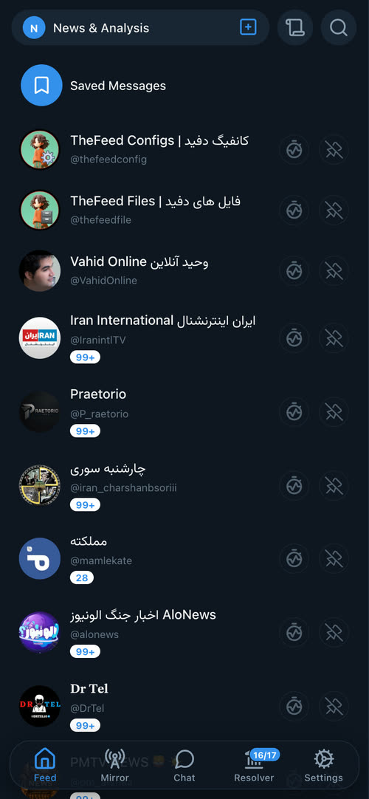
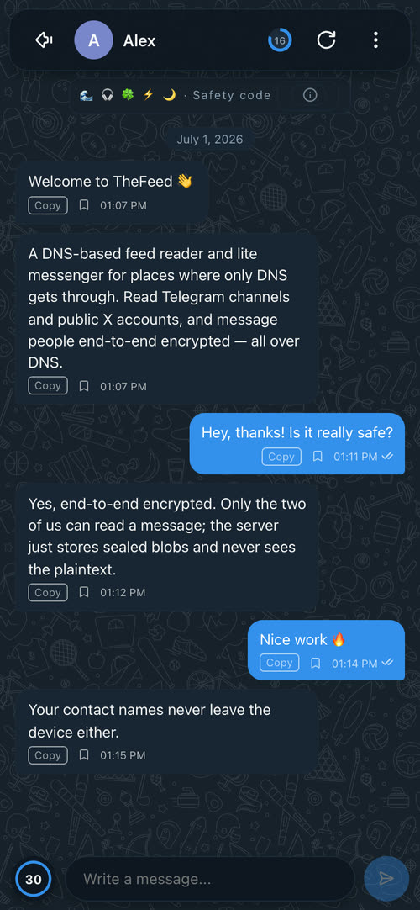
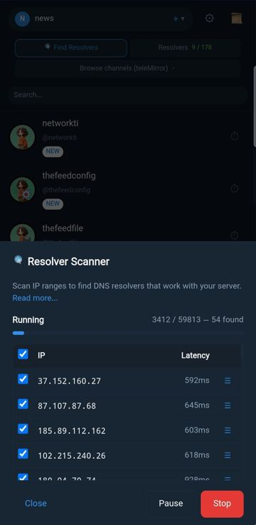
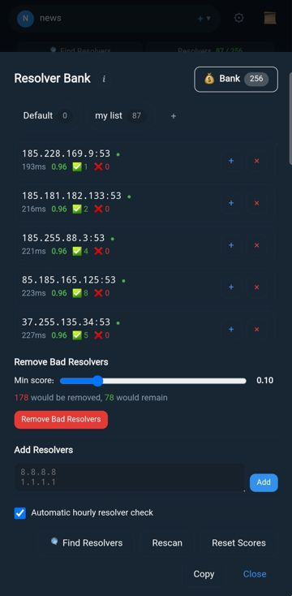
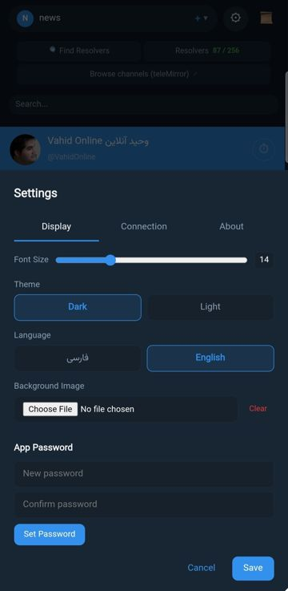

<div dir="rtl" align="right">

# thefeed

**فیدریدر و پیام‌رسان لایت مبتنی بر DNS برای شبکه‌هایی که فقط DNS از آن‌ها عبور می‌کند.** کانال‌های تلگرام و حساب‌های عمومی X را بخوانید و با کاربران دیگر پیام‌های رمزنگاری‌شدهٔ سرتاسری رد‌و‌بدل کنید — همه از طریق DNS ساده.

[English](README.md) · فارسی · [简体中文](README-ZH.md) · [Русский](README-RU.md)

**فهرست:** [نصب برنامه](#install-app) · [راه‌اندازی سرور](#run-server) · [پیام‌رسان](#messenger) · [طرز کار](#how-it-works) · [امنیت](#security) · [ساخت از سورس](#build) · [مرجع](#reference) · [لینک‌ها](#links)

## تصاویر

<table align="center">
<tr>
<td align="center"><br><sub>فید اصلی</sub></td>
<td align="center"><br><sub>پیام‌رسان</sub></td>
<td align="center"><br><sub>خواندن پست</sub></td>
<td align="center"><br><sub>تله‌میرور</sub></td>
</tr>
<tr>
<td align="center"><br><sub>اسکنر ریزالور</sub></td>
<td align="center"><br><sub>بانک ریزالور</sub></td>
<td align="center"><br><sub>تنظیمات</sub></td>
</tr>
</table>

---

<a id="install-app"></a>

## نصب برنامه

*برای کسانی که فقط می‌خواهند فید بخوانند و چت کنند — نیازی به سرور ندارید، فقط یک کانفیگ را در برنامه ایمپورت کنید.*

کلاینت پلتفرم خود را از آخرین انتشار دانلود کنید — هر لینکی که در دسترس بود: **[GitHub](https://github.com/sartoopjj/thefeed/releases/latest)** · **[GitLab](https://gitlab.com/sartoopjj/thefeed/-/releases)**.

<div dir="rtl">

| پلتفرم | توضیح |
|--------|-------|
| **اندروید** (۷ به بالا) | فایل APK. نسخهٔ `arm64-v8a` (گوشی‌های تقریباً بعد از ۱۳۹۶) یا `armeabi-v7a` (فقط دستگاه‌های قدیمی ۳۲ بیتی). نصب نسخهٔ اشتباه انجام می‌شود ولی اجرا نمی‌شود. |
| **iOS** (۱۳ به بالا) | نصب از طریق **[TestFlight](https://testflight.apple.com/join/J6bfxDdZ)**. نسخهٔ App Store در برنامهٔ کار است؛ می‌توانید از سورس در پوشهٔ [ios/](ios/) هم بسازید — بخش [ساخت از سورس](#build). |
| **ویندوز** (۱۰/۱۱) | فایل `.exe` **امضای دیجیتال ندارد**، برای همین SmartScreen پیام «Windows protected your PC» می‌دهد و ممکن است Defender آن را قرنطینه کند — هشدار اشتباه رایج برای ابزارهای تونل DNS، **نه بدافزار**. روی **More info → Run anyway** بزنید؛ اگر حذف شد از Defender → *Protection history* برش گردانید و در صورت تردید هش SHA-256 صفحهٔ انتشار را بررسی کنید. |
| **مک** | فایل `.dmg` یونیورسال (اینتل + Apple Silicon) که با کشیدن، `Thefeed.app` را نصب می‌کند. امضا نشده، پس در اولین اجرا یا در Finder راست‌کلیک → **Open**، یا در ترمینال: `xattr -dr com.apple.quarantine /Applications/Thefeed.app`. |
| **لینوکس / Termux** | باینری `thefeed-client` — اجرا کنید و `http://127.0.0.1:8080` را باز کنید. |

</div>

سپس **تنظیمات → کانفیگ‌ها** را باز کنید و یک کانفیگ ایمپورت کنید (یا دامنه و رمز عبور را وارد کنید). ریزالورهای DNS در تب **ریزالور** مدیریت می‌شوند — یک بانک مشترک برای همهٔ کانفیگ‌ها، به‌علاوهٔ یک اسکنر برای یافتن ریزالورهای بیشتر.

**کانفیگ‌های عمومی برای تست:** [@thefeedconfig](https://t.me/thefeedconfig).

---

<a id="run-server"></a>

## راه‌اندازی سرور

*برای اپراتورهایی که سرور می‌زنند تا فید را برای دیگران سرو کنند.* سرور **خارج از** شبکهٔ سانسورشده اجرا می‌شود، از تلگرام / X می‌خواند و به کوئری‌های رمزنگاری‌شدهٔ DNS پاسخ می‌دهد. راه‌اندازی دو مرحله است: **(۱) رکوردهای DNS**، سپس **(۲) نصب**.

### ۱. رکوردهای DNS

به یک رکورد **A** و یک واگذاری **NS** نیاز دارید. فرض کنید IP سرور شما `203.0.113.10` و دامنه‌تان `example.com` است.

<div dir="ltr" align="left">

| # | Type | Name | Value | هدف |
|---|------|------|-------|-----|
| 1 | A  | `ns.example.com` | `203.0.113.10`   | یک نام میزبان به سرور شما اشاره می‌کند |
| 2 | NS | `t.example.com`  | `ns.example.com` | واگذاری ساب‌دامنهٔ **فید** به سرور شما |
| 3 *(اختیاری)* | NS | `c.example.com` | `ns.example.com` | واگذاری ساب‌دامنهٔ **پیام‌رسان** — فقط اگر [چت](#messenger) را فعال کنید |

</div>

رکوردهای **۱ و ۲** برای فید لازم‌اند. رکورد **۳** فقط برای [پیام‌رسان](#messenger) اختیاری لازم است که باید روی ساب‌دامنه‌ای **جدا** از فید باشد (مثلاً `c.example.com`).

### ۲. نصب سرور

بعد از تنظیم DNS، با **اسکریپت** یا با **Docker** نصب کنید.

#### گزینهٔ الف — اسکریپت نصب (لینوکس + systemd)

اسکریپت به‌صورت خودکار لینک در دسترس را پیدا می‌کند (اول GitHub، بعد GitLab)؛ برای اجبار به GitLab از `--gitlab` استفاده کنید.

<div dir="ltr" align="left">

```bash
# از GitHub
sudo bash -c "$(curl -Ls https://raw.githubusercontent.com/sartoopjj/thefeed/main/scripts/install.sh)"

# از GitLab (وقتی اکانت GitHub در دسترس نیست)
sudo bash -c "$(curl -Ls https://gitlab.com/sartoopjj/thefeed/-/raw/main/scripts/install.sh)" -- --gitlab
```

</div>

اسکریپت آخرین باینری را دانلود می‌کند، دامنه / رمز عبور / کانال‌ها / حساب‌های X را می‌پرسد، می‌پرسد که آیا از لاگین تلگرام استفاده کنید (پیشنهاد: **نه** — کانال‌های عمومی بدون آن کار می‌کنند) و سرویس systemd می‌سازد. برای **بروزرسانی** هر زمان دوباره اجرایش کنید.

کارهای دیگر (اسکریپت را به `sudo bash -s -- <flag>` بدهید):

<div dir="ltr" align="left">

| Flag | کار |
|------|-----|
| `--version v0.9.2` (یا `-v`) | نصب یک تگ مشخص (بازگشت به عقب) |
| `--pre` | نصب آخرین پیش‌انتشار (beta / rc) |
| `--list` | فهرست انتشارهای اخیر |
| `--login` | لاگین مجدد تلگرام |
| `--config` | چاپ پیوند ایمپورت (دامنه، کلید، کلید سرور `sk=`، ریزالورها) |
| `--uninstall` | حذف سرویس |

</div>

#### گزینهٔ ب — Docker

بدون نیاز به Go. ایمیج پایه `alpine:3.21` (حدود ۲۳ مگابایت)، اجرا با کاربر غیر root به نام `thefeed` (UID 1000).

<div dir="ltr" align="left">

```bash
# ۱. تنظیم — THEFEED_DOMAIN و THEFEED_KEY را ست کنید (اگر کانال خصوصی می‌خواهید متغیرهای تلگرام را از کامنت خارج کنید)
cp .env.example .env && nano .env

# ۲. افزودن کانال‌ها
mkdir -p data
cp configs/channels.txt data/
cp configs/x_accounts.txt data/   # اختیاری

# ۳. ساخت و اجرا (داخل کانتینر روی :5300/udp)
docker compose up -d
docker compose logs -f

# ۴. چاپ کانفیگ ایمپورت کلاینت (پیوند thefeed:// — دامنه، کلید، کلید سرور sk=، ریزالورها)
#    تا به کاربران بدهید، درست مثل خروجی انتهای اسکریپت:
docker compose run --rm server --print-config --data-dir /data --domain YOUR_DOMAIN --key YOUR_KEY
```

</div>

سپس [ریدایرکت پورت ۵۳](#port53) پایین را انجام دهید. برای کانال‌های خصوصی، اول یک‌بار لاگین تعاملی انجام دهید:

<div dir="ltr" align="left">

```bash
docker compose run -it --rm server --login-only --data-dir /data \
  --domain YOUR_DOMAIN --key YOUR_KEY \
  --api-id YOUR_API_ID --api-hash YOUR_HASH --phone YOUR_PHONE
# سپس --no-telegram را از docker-compose.yml حذف، فلگ‌های تلگرام را اضافه، و `docker compose up -d`
```

</div>

<a id="port53"></a>

### پورت ۵۳

سرور باید DNS **خارجی** را روی UDP پورت **۵۳** بگیرد، ولی گرفتن مستقیم `:53` با `systemd-resolved` تداخل دارد. پس سرور روی پورت غیرمحدود (`:5300`) گوش می‌دهد و شما `:53` خارجی را با `iptables` به آن ریدایرکت می‌کنید. DNS محلی هاست دست‌نخورده می‌ماند — فقط بسته‌های اینترفیس خارجی ریدایرکت می‌شوند.

<div dir="ltr" align="left">

```bash
# eth0 را با اینترفیس خود جایگزین کنید (بررسی: ip a)
sudo iptables  -I INPUT -p udp --dport 5300 -j ACCEPT
sudo iptables  -t nat -I PREROUTING -i eth0 -p udp --dport 53 -j REDIRECT --to-ports 5300
sudo ip6tables -I INPUT -p udp --dport 5300 -j ACCEPT
sudo ip6tables -t nat -I PREROUTING -i eth0 -p udp --dport 53 -j REDIRECT --to-ports 5300

# ماندگار کردن بعد از ریبوت (Debian/Ubuntu)
sudo apt install -y iptables-persistent && sudo netfilter-persistent save
```

</div>

اگر چیزی خراب شد، **حذف فوری**:

<div dir="ltr" align="left">

```bash
sudo iptables -t nat -D PREROUTING -i eth0 -p udp --dport 53 -j REDIRECT --to-ports 5300
sudo iptables -D INPUT -p udp --dport 5300 -j ACCEPT
sudo netfilter-persistent save
```

</div>

بررسی‌های سریع: `ss -ulnp | grep ':53 '` (باید فقط `systemd-resolved` روی `127.0.0.53` باشد)، `dig +short google.com @127.0.0.53` (DNS محلی هنوز کار می‌کند)، `iptables -t nat -L PREROUTING -n | grep 5300` (ریدایرکت فعال است).

### مدیریت سرویس

<div dir="ltr" align="left">

```bash
systemctl status thefeed-server
systemctl restart thefeed-server
journalctl -u thefeed-server -f

sudo vi /opt/thefeed/data/channels.txt   # ویرایش کانال‌ها، سپس:
sudo systemctl restart thefeed-server
```

</div>

سرور از گزارش‌های ساعتی‌اش (`<data-dir>/dns_hourly.jsonl`) یک داشبورد ترمینالی هم می‌سازد — چیزی روی شبکه سرو نمی‌کند، فقط پوشهٔ دیتا را می‌خواند:

<div dir="ltr" align="left">

```bash
thefeed-server --data-dir /srv/thefeed --report                   # نمای لحظه‌ای
thefeed-server --data-dir /srv/thefeed --report --report-refresh 5s   # زنده
```

</div>

مجموع کوئری‌ها (فتچ کانال، متادیتا، مدیا، چت)، میانگین هر کانال و هر دامنه و آمار چت را نشان می‌دهد.

<a id="server-flags"></a>

### پرچم‌های سرور

پرچم‌های کلیدی (با متغیر محیطی هم قابل تنظیم‌اند، مثل `THEFEED_DOMAIN`، `THEFEED_KEY`):

<div dir="ltr" align="left">

| Flag | Default | توضیح |
|------|---------|-------|
| `--data-dir` | `./data` | دایرکتوری داده (کانال، session، کش، کانفیگ) |
| `--domain` | | دامنهٔ DNS فید **(الزامی)** |
| `--key` | | رمز عبور رمزنگاری **(الزامی)** |
| `--extra-domains` | | ساب‌دامنه‌های فید اضافی (توزیع بار + مقاومت) |
| `--chat-domains` | | فعال‌سازی [پیام‌رسان](#messenger) روی این ساب‌دامنه‌ها (جدا از فید) |
| `--no-telegram` | `false` | اجرا بدون لاگین تلگرام (فقط کانال‌های عمومی) |
| `--api-id` / `--api-hash` / `--phone` | | اطلاعات تلگرام (کانال خصوصی) |
| `--login-only` | `false` | لاگین تلگرام، ذخیرهٔ session، خروج |
| `--listen` | `:5300` | آدرس شنود DNS |
| `--msg-limit` | `15` | حداکثر پیام هر کانال |
| `--fetch-interval` | `10` | فاصلهٔ چرخهٔ فتچ بر حسب دقیقه (حداقل ۳) |
| `--allow-manage` | `false` | اجازهٔ ارسال / مدیریت کانال از راه دور (فقط روی سرور مورد اعتماد فعال کنید) |
| `--padding` | `32` | حداکثر padding تصادفی (ضد DPI؛ ۰ = خاموش) |
| `--x-rss-instances` | `nitter.net,…` | آدرس‌های پایهٔ RSS برای X |
| `--dns-media-enabled` | `false` | سرو مدیا روی رلهٔ کند DNS |
| `--github-relay-enabled` | `false` | سرو مدیا روی رلهٔ سریع گیتهاب (نیازمند `--github-relay-token` / `-repo`) |
| `--report` | | نمایش داشبورد ترمینالی و خروج |
| `--version` | | نمایش نسخه و خروج |

</div>

پرچم‌های کامل رلهٔ مدیا در [طرز کار ← رله‌های مدیا](#media-relays).

---

<a id="messenger"></a>

## پیام‌رسان

یک پیام‌رسان **اختیاری** و مستقلِ ذخیره-و-ارسال بین کاربران همان سرور — هیچ ارتباطی با تلگرام ندارد. با دادن یک یا چند ساب‌دامنهٔ اختصاصی (با [رکورد NS](#run-server) متناظر، جدا از دامنه‌های فید) فعالش کنید:

<div dir="ltr" align="left">

```bash
thefeed-server ... --chat-domains c.example.com     # یا THEFEED_CHAT_DOMAINS=c.example.com
```

</div>

- **رمزنگاری سرتاسری** — فقط دو طرف می‌توانند پیام را بخوانند؛ سرور فقط داده مبهم نگه می‌دارد و بدون خواندن محتوا فرستنده را راستی‌آزمایی می‌کند. نام مخاطبان هرگز از دستگاه خارج نمی‌شود.
- **هویت** — کلاینت یک کد بازیابی به‌صورت محلی می‌سازد؛ آدرس شما ۲۰ کاراکتر از آن مشتق می‌شود. آدرس را خارج از این کانال به مخاطب بدهید؛ همان کد بازیابی روی هر سروری کار می‌کند.
- **fail-closed** — چت فقط وقتی فعال می‌شود که کلید سرور (`sk=`) در پروفایل پین باشد و قابلیت چت امضاشدهٔ سرور تأیید شود. یک بیت امضاشده در متادیتای فید باعث می‌شود کلاینت بدون کلید بگوید «این سرور پیام‌رسان دارد — کانفیگ را با کلیدش دوباره وارد کن» به‌جای شکست بی‌صدا.
- **محدودیت‌های ضد سوءاستفاده** (به کلاینت اعلام می‌شود): `--chat-send-per-hour` (۳۰)، `--chat-inbox-cap` (۵۰)، `--chat-per-pair-cap` (۱۰)، `--chat-max-msg-bytes` (۵۰۰)؛ پیام‌های تحویل‌نشده بعد از `--chat-ttl-hours` (۷۲) منقضی می‌شوند. با `--chat-enabled=false` دامنه‌ها می‌مانند ولی چت «غیرفعال» اعلام می‌شود.

در کلاینت، **چت** را از نوار پایین باز کنید. ✓ = روی سرور ذخیره شد، ✓✓ = گیرنده دریافت کرد؛ یکسان بودن ایموجی‌های امنیتی در دو دستگاه یعنی گفتگو امن است.

---

<a id="how-it-works"></a>

## طرز کار

<div dir="ltr" align="left">

```
                                  Encrypted DNS TXT
   ┌──────────────┐  feed meta + small media   ┌──────────────────┐    MTProto      ┌──────────┐
   │              │ ─────────────────────────▸ │      Server      │ ─────────────▸  │ Telegram │
   │    Client    │ ◂───────────────────────── │  (DNS auth +     │ ◂─────────────  │   API    │
   │  (Web UI)    │                            │   media relays)  │    RSS / HTTP   ┌──────────┐
   │              │  large media (fast relay)  │                  │ ─────────────▸  │  Nitter  │
   │              │ ◂───── api.github.com ◂──  │                  │ ◂─────────────  │ (X feed) │
   └──────────────┘     (uploaded by server)   └──────────────────┘                 └──────────┘
```

</div>

**سرور** (خارج از شبکهٔ سانسورشده): به تلگرام وصل می‌شود و کانال‌های تنظیم‌شده را می‌خواند؛ پست‌های عمومی X را از میرورهای سازگار با RSS می‌گیرد (بدون لاگین)؛ متادیتای فید و فایل‌های کوچک را به‌صورت پاسخ **DNS TXT رمزنگاری‌شده** با padding تصادفی (ضد DPI) سرو می‌کند. یک‌بار لاگین، همیشه اجرا؛ `--no-telegram` کانال‌های عمومی را بدون اطلاعات ورود می‌خواند. حالت‌های اختیاری **چند دامنه‌ای** و **[پیام‌رسان](#messenger)**. همهٔ داده در یک پوشه.

**کلاینت** (داخل شبکهٔ سانسورشده): رابط وب مبتنی بر مرورگر (RTL/فارسی، فونت وزیرمتن) که کوئری‌های رمزنگاری‌شدهٔ DNS را از طریق یک **بانک ریزالور** مشترک می‌فرستد — ریزالورها با اسکنر، ایمپورت یا ورود دستی اضافه و بر اساس نرخ موفقیت + تأخیر امتیازدهی می‌شوند تا سالم‌ها ترجیح داده شوند. حالت **scatter** یک کوئری را به چند ریزالور می‌فرستد و سریع‌ترین پاسخ را برمی‌دارد. دانلود مدیا رله‌آگاه است و هش/سایز اعتبارسنجی می‌شود. شامل [پیام‌رسان](#messenger)، به‌روزرسانی خودکار هر کانال، نشانگر پیام جدید و لاگ زندهٔ DNS.

### پروتکل

همهٔ ارتباط‌ها رمزنگاری‌شده (AES-256) هستند و روی کوئری/پاسخ استاندارد DNS TXT با padding متغیر و امتیازدهی ریزالور سوار می‌شوند تا با DNS عادی مخلوط شوند. دادهٔ پیام قبل از رمزنگاری با deflate فشرده می‌شود؛ هر کوئری مستقل است (بدون state روی شبکه).

<a id="media-relays"></a>

### رله‌های مدیا

پیام‌های دارای عکس، فایل، گیف، صدا و ویدیو می‌توانند روی سرور کش و از همین کانال دانلود شوند. سرور هر فایل را dedupe می‌کند (بر اساس id بالادست + هش محتوا)، بایت‌ها را به هر رلهٔ فعال می‌فرستد و یک هدر کوچک به متن پیام اضافه می‌کند:

<div dir="ltr" align="left">

```
[IMAGE]<size>:<flags>:<dnsCh>:<dnsBlk>:<crc32>[:<filename>]
optional caption
```

</div>

`<flags>` فهرست جدا با کاما از بیت‌های در دسترس بودن هر رله است (`1`=در دسترس، `0`=نه): اسلات ۰ = DNS، اسلات ۱ = گیتهاب، رله‌های آینده اضافه می‌شوند؛ کلاینت‌های قدیمی اسلات‌های ناشناخته را نادیده می‌گیرند. هر رله مستقل است — یک فایل می‌تواند هم‌زمان از چند مسیر سرو شود. کلاینت سریع‌ترین مسیر در دسترس را ترجیح می‌دهد، در خطا retry می‌کند و قبل از فال‌بک به مسیر کندتر می‌پرسد. بلاک ۰ هر فایل کش‌شده روی DNS با یک هدر ۱۶ بایتی (CRC32 + نسخه + بایت فشرده‌سازی + رزرو) شروع می‌شود که کلاینت قبل از تحویل بایت‌ها آن را بررسی می‌کند. دانلودها سمت کلاینت (IndexedDB، ۷ روز) و روی کلاینت محلی (`<dataDir>/media-cache/`، ۷ روز) کش می‌شوند.

دو رله الان موجودند:

- **رلهٔ DNS** (کند، مقاوم به سانسور، پیش‌فرض خاموش) — بایت‌ها بین بلاک‌های DNS تقسیم می‌شوند. سقف پیش‌فرض ۱۰۰ کیلوبایت.
- **رلهٔ گیتهاب** (سریع، پیش‌فرض خاموش) — بایت‌ها روی یک ریپازیتوری آپلود و با HTTPS ساده گرفته می‌شوند؛ نیازمند PAT با `contents:write`. فایل‌ها در `<repo>/<sanitised-domain>/<size>_<crc32>` قرار می‌گیرند. سقف پیش‌فرض ۱۵ مگابایت.

<div dir="ltr" align="left">

| Flag | Env | Default | Notes |
|------|-----|---------|-------|
| `--dns-media-enabled` | `THEFEED_DNS_MEDIA_ENABLED` | `false` | toggle DNS relay |
| `--dns-media-max-size` | `THEFEED_DNS_MEDIA_MAX_SIZE_KB` | `100` KB | per-file cap |
| `--dns-media-compression` | `THEFEED_DNS_MEDIA_COMPRESSION` | `gzip` | `none` / `gzip` / `deflate` |
| `--github-relay-enabled` | `THEFEED_GITHUB_RELAY_ENABLED` | `false` | toggle GitHub relay |
| `--github-relay-token` | `THEFEED_GITHUB_RELAY_TOKEN` | — | PAT, `contents:write` |
| `--github-relay-repo` | `THEFEED_GITHUB_RELAY_REPO` | — | `owner/repo` |
| `--github-relay-branch` | `THEFEED_GITHUB_RELAY_BRANCH` | `main` | branch |
| `--github-relay-max-size` | `THEFEED_GITHUB_RELAY_MAX_SIZE_KB` | `15360` KB | per-file cap |

</div>

---

<a id="security"></a>

## امنیت

**کنترل دسترسی دو بخشی:**

- **رمز عبور رمزنگاری (`--key`)** — روی سرور و کلاینت هر دو لازم است. هر کسی آن را داشته باشد می‌تواند همهٔ پیام‌ها (از جمله کانال‌های خصوصی) را بخواند؛ فقط با افراد مورد اعتماد به اشتراک بگذارید.
- **مدیریت از راه دور (`--allow-manage`)** — وقتی فعال باشد، هر کسی با رمز عبور می‌تواند از کلاینت: **با اکانت تلگرامِ سمت سرور پیام بفرستد** (به کانال‌ها / چت‌های خصوصی — این ارسال از طریق اکانت تلگرامِ لاگین‌شدهٔ اپراتور است و **کاملاً متفاوت** با [پیام‌رسان](#messenger) سرتاسری است)، و **لیست کانال‌های فید را عوض کند** (افزودن یا حذف کانال‌های نمایش‌داده‌شده در فید). پیش‌فرض خاموش؛ فقط روی سرور مورد اعتماد فعال کنید.
- **رمز وب کلاینت (`--password`)** — HTTP Basic Auth روی رابط وب. فقط محافظت محلی؛ روی دسترسی DNS اثری ندارد.

**ویژگی‌ها:** AES-256 سرتاسری در هر دو جهت · padding تصادفی تحلیل اندازه را خنثی می‌کند · هر کوئری مستقل (بدون state روی شبکه) · نوشتن پشت `--allow-manage` · احراز دومرحله‌ای تلگرام تعاملی پرسیده می‌شود (هرگز در آرگومان ذخیره نمی‌شود) · فایل session با مجوز `0600`.

> **⚠️ هرگز رمز عبور رمزنگاری خود را عمومی به اشتراک نگذارید.** هر کسی آن را داشته باشد می‌تواند کلاینت خودش را اجرا و همهٔ پیام‌های شما را بخواند — هیچ راهی برای جلوگیری نیست. `--password` فقط رابط وب روی دستگاه خودتان را محافظت می‌کند.

[پیام‌رسان](#messenger) اختیاری به‌صورت جداگانه و برای هر گفتگو سرتاسری رمزنگاری می‌شود و مستقل از رمز عبور فید است.

---

<a id="build"></a>

## ساخت از سورس

**پیش‌نیازها:** Go 1.26+ و (برای کانال‌های خصوصی) اطلاعات API تلگرام از <https://my.telegram.org>.

<div dir="ltr" align="left">

```bash
make build          # ساخت سرور + کلاینت در ./build
make build-server   # فقط سرور
make build-client   # فقط کلاینت
make test           # تست‌ها با race detector
make build-all      # کراس‌کامپایل همهٔ پلتفرم‌ها (شامل اندروید)
make vet            # go vet
```

</div>

**اجرای سرور** (بخش [پرچم‌ها](#server-flags)):

<div dir="ltr" align="left">

```bash
./build/thefeed-server --data-dir ./data --domain t.example.com --key "passphrase" --no-telegram --listen ":5300"
# کانال خصوصی: یک‌بار --login-only (با --api-id/--api-hash/--phone) اجرا کنید، بعد بدون آن
```

</div>

**اجرای کلاینت:** `./build/thefeed-client` (پوشهٔ `./thefeeddata/` را می‌سازد و `http://127.0.0.1:8080` را باز می‌کند). گزینه‌ها: `--data-dir`، `--port` (۸۰۸۰)، `--password`. گزینه‌های هر کانفیگ (ریزالور، scatter، ریت‌لیمیت، تایم‌اوت) در رابط وب تنظیم می‌شوند نه با پرچم.

**مک:** `make mac-dmg` → `build/Thefeed.app` + فایل `.dmg` یونیورسال. داده زیر `~/Library/Application Support/Thefeed`؛ یک آیتم نوار منو گزینهٔ **Open / Quit** می‌دهد.

**APK اندروید:**

<div dir="ltr" align="left">

```bash
make build-android-arm64
cp build/thefeed-client-android-arm64 android/app/src/main/assets/thefeed-client
cd android && gradle wrapper --gradle-version 8.10.2 && ./gradlew assembleDebug
# → android/app/build/outputs/apk/debug/app-debug.apk
```

</div>

**iOS:** کلاینت Go را به‌صورت یک xcframework باندشده با gomobile می‌پیچد که یک اپ SwiftUI در `ios/` مصرفش می‌کند. سرور در فرآیند روی `127.0.0.1:<random-port>` اجرا می‌شود، فقط foreground. نیازمند Xcode 15+، Go 1.26+، gomobile (`go install golang.org/x/mobile/cmd/gomobile@latest && gomobile init`).

<div dir="ltr" align="left">

```bash
make ios-bind    # ساخت Mobile.xcframework (دستگاه + Simulator)
make ios-build   # بیلد اپ برای Simulator
```

</div>

سپس `ios/Thefeed.xcodeproj` را در Xcode باز کنید تا روی دستگاه اجرا شود.

**انتشارها:** push یک تگ که با `v` شروع شود، بیلد CI + انتشار را راه می‌اندازد. تگ حاوی `-` (مثل `v1.4.0-rc1`) خودکار پیش‌انتشار علامت می‌خورد. اسمبل‌ها شامل باینری سرور/کلاینت همهٔ پلتفرم‌ها به‌علاوهٔ APKهای اندروید (`arm64-v8a`، `armeabi-v7a`) است.

---

<a id="reference"></a>

## مرجع

### فرمت فایل‌های کانفیگ

همه اختیاری‌اند و در پوشهٔ دیتا قرار می‌گیرند؛ `#` شروع کامنت است و خطوط خالی نادیده گرفته می‌شوند.

- **`channels.txt`** — کانال‌های عمومی تلگرام، هر خط یک `@username`.
- **`x_accounts.txt`** — نام کاربری‌های عمومی X (توییتر)، هر خط یکی.
- **`private_channels.txt`** — لینک‌های دعوت کانال‌های خصوصی، هر خط یکی. نیازمند لاگین تلگرام است — سرور هنگام شروع به هر کانال جوین می‌شود و بعد مثل بقیه از آن پیام می‌خواند. این شکل‌ها پذیرفته می‌شوند: `https://t.me/+…`، `t.me/joinchat/…`، `tg://join?invite=…`، یا فقط هش دعوت.

<div dir="ltr" align="left">

```
# channels.txt      # x_accounts.txt    # private_channels.txt
@VahidOnline        Vahid               https://t.me/+aBcDeF123456
```

</div>

### رابط وب

پوسته‌ای به سبک تلگرام با **نوار ناوبری پایین** در پنج بخش:

- **فید** — فید کانال/X به تفکیک نوع (عمومی/X/خصوصی)، رندر بومی RTL/فارسی، نوار نوشتن شناور (ارسال به کانال/چت خصوصی وقتی تلگرام وصل است)، نشان پیام جدید هر کانال، هایلایت تگ مدیا، جستجوی داخل کانال و لاگ زندهٔ DNS. **پیام‌های ذخیره‌شده** (یادداشت + نشانک رمزنگاری‌شدهٔ محلی) این‌جاست.
- **میرور** (تله‌میرور) — آینهٔ فقط‌خواندنی کانال‌ها به سبک وب تلگرام با رندر عکس/آلبومِ پایدار در نسبت ابعاد.
- **چت** — [پیام‌رسان](#messenger) سرتاسر رمزنگاری‌شده.
- **ریزالور** — **بانک** مشترک، **لیست‌های** نام‌گذاری‌شده و **اسکنر** در یک جا. اسکنر IP / CIDR (مثل `5.1.0.0/16`) یا دامنه را بررسی می‌کند تا سرورهای DNS قابل دسترسی به سرور شما را پیدا کند؛ نتایج بر اساس تأخیر مرتب می‌شوند، /24 یک ریزالور کارآمد گسترش می‌یابد و می‌توان مستقیم روی یک کانفیگ اعمالشان کرد. یک دکمهٔ یک‌کلیکی لیست CIDR آماده را بارگذاری می‌کند.
- **تنظیمات** — **نمایش** (پوسته، فونت، زبان، تصویر پس‌زمینه)، **اتصال** (حالت کوئری، ریت‌لیمیت، scatter، تایم‌اوت، رمز، دیباگ)، **حافظه** (سقف کش دیسک)، **پشتیبان‌گیری** (خروجی/ورودی رمزنگاری‌شده)، **درباره** و **کانفیگ‌ها** (ایمپورت/مدیریت با کانفیگ‌های آماده). پوسته به‌صورت پیش‌فرض از دستگاه پیروی می‌کند. همهٔ فیلدها خودکار ذخیره می‌شوند.

### نکات امنیتی دریافت X

پست‌های X فقط از RSS/XML گرفته می‌شوند. آدرس instanceها اعتبارسنجی می‌شوند (`http`/`https`، فقط host)، اندازهٔ پاسخ محدود و timeout اعمال می‌شود و در `403`/خطا سرور instance بعدی را امتحان می‌کند. میرورهای مورد اعتماد خودتان را با `--x-rss-instances` تنظیم کنید.

---

<a id="links"></a>

## لینک‌ها و حمایت

- کانال تلگرام: [@networkti](https://t.me/networkti) · کانفیگ عمومی: [@thefeedconfig](https://t.me/thefeedconfig)
- لیست تسک‌ها و رودمپ: [بورد گیتهاب](https://github.com/users/sartoopjj/projects/1/views/1)

**حمایت مالی** — هر مبلغی به‌صورت USDT یا USDC روی **Polygon** یا **BNB Chain**:
`0xe73f022f668c57cce79feccd875ac7332311013a` — ممنون از حمایت‌تون ❤️

## لایسنس

MIT

---

<div align="center">

**برای ایران آزاد** 

*هر ایرانی حق دسترسی آزاد به اطلاعات را دارد*

</div>

</div>
