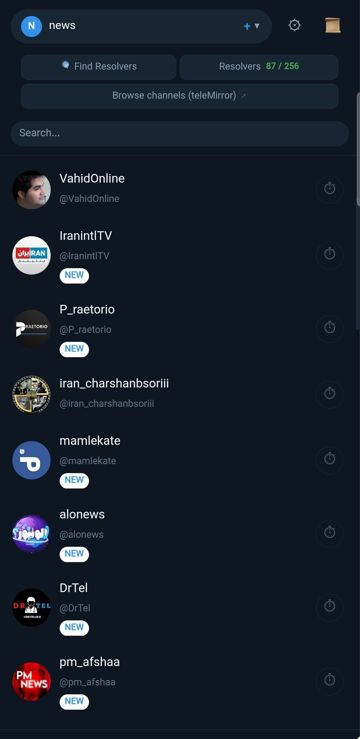

<div dir="rtl" align="right">

# 🌍 thefeed

**خواندن کانال‌های تلگرام و حساب‌های عمومی X از طریق DNS — برای اینترنت سانسورشده**

[English](README.md) | فارسی

---

## دانلود

- **آخرین انتشار** — باینری سرور و کلاینت برای همه پلتفرم‌ها به علاوهٔ APK اندروید. از هر کدوم از این دو لینک که در دسترس بود استفاده کنید: [GitLab](https://gitlab.com/sartoopjj/thefeed/-/releases) / [GitHub](https://github.com/sartoopjj/thefeed/releases/latest).
- **نصب سرور با یک خط** (لینوکس + systemd) — هر کدوم از این دوتا که در دسترس باشه استفاده کنید:
<div dir="ltr" align="left">

```bash
# از GitHub
sudo bash -c "$(curl -Ls https://raw.githubusercontent.com/sartoopjj/thefeed/main/scripts/install.sh)"

# از GitLab (در صورتی که اکانت GitHub موقتاً در دسترس نباشه)
sudo bash -c "$(curl -Ls https://gitlab.com/sartoopjj/thefeed/-/raw/main/scripts/install.sh)" -- --gitlab
```

</div>

- **APK اندروید**: گوشی‌های جدیدتر از حدود ۱۳۹۶ نسخه `arm64-v8a` و دستگاه‌های قدیمی ۳۲ بیتی نسخه `armeabi-v7a` را نصب کنند.

کانفیگ‌های عمومی برای تست: [@thefeedconfig](https://t.me/thefeedconfig).

---

## تصاویر

<table align="center">
<tr>
<td align="center"><br><sub>فید اصلی</sub></td>
<td align="center"><br><sub>خواندن پست</sub></td>
<td align="center"><br><sub>تله‌میرور</sub></td>
</tr>
<tr>
<td align="center"><br><sub>اسکنر ریزالور</sub></td>
<td align="center"><br><sub>بانک ریزالور</sub></td>
<td align="center"><br><sub>تنظیمات</sub></td>
</tr>
</table>

---

## thefeed چیست؟

thefeed یک سیستم تونل DNS است که به شما اجازه می‌دهد پیام‌های کانال‌های تلگرام را حتی وقتی تلگرام و اینترنت فیلتر شده، بخوانید. تنها چیزی که نیاز دارید **DNS** است — که تقریباً هیچ‌وقت مسدود نمی‌شود.

<div dir="ltr" align="left">

```
                                  Encrypted DNS TXT
   ┌──────────────┐  feed meta + small media   ┌──────────────────┐    MTProto      ┌──────────┐
   │              │ ─────────────────────────▸ │      Server      │ ─────────────▸  │ Telegram │
   │    Client    │ ◂───────────────────────── │  (DNS auth +     │ ◂─────────────  │   API    │
   │  (Web UI)    │                            │   media relays)  │    RSS / HTTP   ┌──────────┐
   │              │  large media (fast relay)  │                  │ ─────────────▸  │  Nitter  │
   │              │ ◂───── api.github.com ◂──  │                  │ ◂─────────────  │ (X feed) │
   └──────────────┘     (uploaded by server)   └──────────────────┘                 └──────────┘
```

</div>

## ✨ ویژگی‌ها

### سمت سرور (خارج از ایران)
- اتصال به تلگرام و خواندن پیام‌ کانال‌ها
- دریافت پست‌های عمومی X از حساب‌های تنظیم‌شده (بدون لاگین)
- سرو متادیتا و فایل‌های کوچک به صورت پاسخ DNS TXT رمزنگاری‌شده
- **رله‌های مدیا** — یک فایل، چند مسیر تحویل:
  - **رله DNS** (کند، مقاوم به سانسور) فایل را به بلاک‌های DNS تقسیم می‌کند
  - **رله گیتهاب** (سریع، پیش‌فرض خاموش) بایت‌ها را روی یک ریپازیتوری گیتهاب می‌گذارد و کلاینت با HTTPS ساده می‌گیرد؛ مناسب فایل‌های بزرگ‌تر از سقف DNS
  - رله‌های آینده در کنار همین‌ها اضافه می‌شوند بدون اینکه کلاینت‌های قدیمی را خراب کنند
- padding تصادفی برای جلوگیری از شناسایی DPI
- ذخیره‌سازی session — یک‌بار لاگین، همیشه اجرا
- پشتیبانی از حالت بدون تلگرام (`--no-telegram`) — خواندن کانال‌های عمومی بدون نیاز به ورود به تلگرام

### سمت کلاینت (داخل ایران)
- رابط کاربری وب با پشتیبانی RTL/فارسی (فونت وزیرمتن)
- ارسال پیام به کانال‌ها و چت‌های خصوصی (نیاز به `--allow-manage` سمت سرور و ورود به تلگرام)
- مدیریت کانال‌ها از راه دور ( افزودن/حذف کانال‌ها از طریق دستورات ادمین وقتی `--allow-manage` فعال است)
- **دانلود مدیا با رله‌ها** — اگر فایل روی رله سریع (گیتهاب) موجود باشد، اول از همان مسیر تلاش می‌کند، در صورت خطا چند بار retry می‌کند و قبل از سوییچ به رله DNS از کاربر می‌پرسد. هش و سایز هر فایل دانلود‌شده حتماً اعتبارسنجی می‌شود
- **به‌روزرسانی خودکار هر کانال**: کانال‌های دلخواه را پین کنید تا در پس‌زمینه به‌طور دوره‌ای رفرش شوند (به ازای هر پروفایل ذخیره می‌شود)
- فشرده‌سازی پیام‌ها (deflate)
- محافظت رابط وب با رمز عبور (`--password` سمت کلاینت)
- لاگ زنده درخواست‌های DNS در مرورگر
- **جستجوی پیام‌ها**: جستجو در پیام‌های کانال فعلی با هایلایت نتایج و ناوبری قبلی/بعدی
- **خروجی پیام‌ها**: کپی N پیام آخر یک کانال به کلیپبورد
- **بانک ریزالور**: مدیریت مشترک ریزالورها برای تمام پروفایل‌ها — بدون نیاز به تنظیم ریزالور جداگانه برای هر پروفایل. ریزالورها از طریق اسکنر، ایمپورت، یا ورود دستی اضافه می‌شوند و به صورت خودکار امتیازدهی می‌شوند
- **پاکسازی ریزالور**: حذف ریزالورهای ضعیف از بانک بر اساس حداقل امتیاز دلخواه
- **نمایش ریزالورهای فعال**: مشاهده لیست ریزالورهای سالم و فعال از تنظیمات
- **تصویر پس‌زمینه**: تنظیم URL تصویر پس‌زمینه برای پنل پیام‌ها (ذخیره محلی)
- **تایم‌اوت DNS**: تنظیم تایم‌اوت کوئری DNS برای هر پروفایل (پیش‌فرض ۱۵ ثانیه)
- **اسکنر ریزالور**: اسکن بازه‌های IP و CIDR برای پیدا کردن سرورهای DNS کارآمد

### اسکنر ریزالور

رابط وب شامل یک اسکنر ریزالور داخلی است (آیکون 🔍 در نوار کناری) که بازه‌های IP را بررسی می‌کند تا سرورهای DNS قابل دسترسی به سرور thefeed شما را پیدا کند:

- **اهداف متنوع**: آی‌پی‌های تکی، CIDR (مثل `5.1.0.0/16`)، یا نام دامنه — هر خط یکی
- **بارگذاری CIDR پیش‌فرض**: دکمه یک‌کلیکی برای بارگذاری لیست پیش‌فرض بازه‌های ISP
- **پاک کردن اهداف**: دکمه برای پاک کردن سریع لیست CIDR/IP اسکنر
- **انتخاب پروفایل**: انتخاب کنید کدام پروفایل برای تست استفاده شود
- **قابل تنظیم**: همزمانی (پیش‌فرض ۵۰)، تایم‌اوت (پیش‌فرض ۱۵ ثانیه)، حداکثر آی‌پی
- **گسترش /24**: وقتی ریزالور کارآمد پیدا شد، آی‌پی‌های نزدیک در همان /24 هم بررسی می‌شوند
- **مکث / ادامه / توقف**: کنترل کامل روی اسکن‌های طولانی (مکث واقعاً ارسال درخواست‌های جدید را متوقف می‌کند)
- **زمان پاسخ**: نتایج بر اساس تأخیر مرتب شده‌اند تا سریع‌ترین‌ها اول نمایش داده شوند
- **انتخاب نتایج**: چک‌باکس برای انتخاب ریزالورهای مورد نظر
- **اعمال نتایج**: افزودن یا جایگزینی بانک ریزالور مستقیم از اسکنر
- **کپی**: دکمه کپی برای هر آی‌پی، کپی انتخاب‌شده‌ها، یا کپی همه
- **اسکن جدید**: بازنشانی رابط کاربری برای شروع اسکن جدید پس از اتمام
- **لاگ دیباگ**: در حالت دیباگ، کوئری‌ها و پاسخ‌های هر probe ثبت می‌شوند

### ضد DPI
- **اندازه متغیر پاسخ**: Padding تصادفی (۰-۳۲ بایت)
- **کوئری تک‌برچسب**: رمزنگاری Base32 در یک برچسب DNS
- **شافل Resolver**: توزیع تصادفی کوئری‌ها بین resolverها
- **بانک ریزالور**: مخزن مشترک ریزالورها با امتیازدهی دائمی و ابزار پاکسازی
- **محدودیت نرخ**: قابل تنظیم برای ترکیب با ترافیک عادی DNS
- **Padding تصادفی کوئری**: ۴ بایت تصادفی در هر درخواست
- **اندازه بلاک متغیر**: بلاک‌های ۴۰۰-۷۰۰ بایت

## 🔐 رمزنگاری و احراز هویت

### مدل دو بخشی

**بخش ۱ — رمز عبور رمزنگاری (`--key`):** روی سرور و کلاینت هر دو لازم است. هر کسی با این رمز می‌تواند همه پیام‌ها (از جمله کانال‌های خصوصی) را بخواند. می‌توانید آن را با دوستان مورد اعتماد به اشتراک بگذارید.

**بخش ۲ — مدیریت از راه دور (`--allow-manage` سمت سرور):** وقتی فعال باشد، هر کسی با کلید رمزنگاری می‌تواند پیام ارسال کند و کانال‌ها را مدیریت کند. به صورت پیش‌فرض غیرفعال است.

**رمز عبور وب کلاینت (`--password`):** تمام صفحات رابط وب را با HTTP Basic Auth محافظت می‌کند. این فقط محافظت محلی است.

### ویژگی‌های امنیتی

- **AES-256-GCM** برای تمام پاسخ‌ها و پیام‌های ارسالی
- کلیدهای مجزا از طریق HKDF برای کوئری و پاسخ
- Padding تصادفی در هر دو جهت
- بدون state — هر درخواست مستقل است
- بررسی رمز عبور ادمین سمت سرور با مقایسه زمان‌ثابت
- فایل session با مجوز ۰۶۰۰

> ⚠️ هرگز رمز عبور رمزنگاری (passphrase) خود را عمومی به اشتراک نگذارید — هر کسی با آن می‌تواند کلاینت خودش را اجرا و تمام پیام‌های شما را بخواند. `--password` سمت کلاینت فقط رابط وب روی دستگاه خودتان را محافظت می‌کند.

## دانلود

[رلیز ها](https://github.com/sartoopjj/thefeed/releases)

## حمایت مالی

برای حمایت از من می‌تونید مبلغ دلخواه‌تون رو به صورت USDT یا USDC روی شبکه‌های زیر ارسال کنید:

-  Polygon
-  BNB Chain

آدرس ولت من:
`0xe73f022f668c57cce79feccd875ac7332311013a`

ممنون از حمایت‌تون ❤️

# لینک ها
- کانال تلگرام من: [@networkti](https://t.me/networkti)
- کانال کانفیگ عمومی دفید: [@thefeedconfig](https://t.me/thefeedconfig)
- راهنمای نصب سرور دفید: [@networkti](https://t.me/networkti/25)
- راهنمای نصب سرور دفید با اسلیپ گیت: [@networkti](https://t.me/networkti/200)
- لیست تسک‌ها و رودمپ پروژه: [بورد گیتهاب](https://github.com/users/sartoopjj/projects/1/views/1)

## ⚡ نصب سریع سرور

اسکریپت نصب می‌تونه باینری رو از GitHub یا GitLab دانلود کنه.
بدون پارامتر اول GitHub رو امتحان می‌کنه و اگه در دسترس نبود می‌ره سراغ GitLab.
برای انتخاب دستی از `--github` یا `--gitlab` استفاده کنید.

```bash
# از GitHub
sudo bash -c "$(curl -Ls https://raw.githubusercontent.com/sartoopjj/thefeed/main/scripts/install.sh)"

# از GitLab
sudo bash -c "$(curl -Ls https://gitlab.com/sartoopjj/thefeed/-/raw/main/scripts/install.sh)" -- --gitlab
```

اسکریپت:
1. آخرین باینری را از مخزن انتخاب‌شده (GitHub یا GitLab) دانلود می‌کند
2. دامنه، رمز عبور، کانال‌های تلگرام و حساب‌های X را می‌پرسد
3. به تلگرام لاگین می‌کند (یک‌بار)
4. سرویس systemd را راه‌اندازی می‌کند

```bash
# بروزرسانی
sudo bash install.sh

# لاگین مجدد تلگرام
sudo bash install.sh --login

# حذف
sudo bash install.sh --uninstall
```


> **توجه:** سرور باید روی پورت ۵۳ پاسخ بدهد. بهتر است روی پورت غیرمحدود (`:5300`) اجرا و با iptables فوروارد کنید:
>
> نام اینترفیس شبکه خود را با `ip a` پیدا کنید و `eth0` را جایگزین کنید:
> ```bash
> sudo iptables -I INPUT -p udp --dport 5300 -j ACCEPT
> sudo iptables -t nat -I PREROUTING -i eth0 -p udp --dport 53 -j REDIRECT --to-ports 5300
> sudo ip6tables -I INPUT -p udp --dport 5300 -j ACCEPT
> sudo ip6tables -t nat -I PREROUTING -i eth0 -p udp --dport 53 -j REDIRECT --to-ports 5300
> ```
>
> برای ماندگار کردن این قوانین بعد از ریبوت:
> ```bash
> sudo apt install iptables-persistent   # Debian/Ubuntu
> sudo netfilter-persistent save
> ```


**اگر مشکلی پیش آمد — حذف فوری redirect:**

```bash
# حذف قانون iptables (بازگشت به حالت اولیه)
sudo iptables -t nat -D PREROUTING -i eth0 -p udp --dport 53 -j REDIRECT --to-ports 5300
sudo iptables -D INPUT -p udp --dport 5300 -j ACCEPT
sudo netfilter-persistent save
```


## 🐳 نصب با Docker (سرور)

اجرای سرور با Docker — بدون نیاز به نصب Go.

### شروع سریع (کانال‌های عمومی، بدون لاگین تلگرام)

```bash
# ۱. تنظیم محیط
cp .env.example .env
nano .env   # مقادیر THEFEED_DOMAIN و THEFEED_KEY را وارد کنید

# ۲. آماده‌سازی دایرکتوری داده
mkdir -p data
cp configs/channels.txt data/
cp configs/x_accounts.txt data/   # اختیاری

# ۳. ساخت و اجرا
docker compose up -d

# ۴. هدایت ترافیک DNS خارجی به کانتینر
#    نام اینترفیس شبکه خود را با ip a پیدا کنید و eth0 را جایگزین کنید
sudo iptables -t nat -I PREROUTING -i eth0 -p udp --dport 53 -j REDIRECT --to-ports 5300
sudo iptables -I INPUT -p udp --dport 5300 -j ACCEPT
sudo ip6tables -t nat -I PREROUTING -i eth0 -p udp --dport 53 -j REDIRECT --to-ports 5300
sudo ip6tables -I INPUT -p udp --dport 5300 -j ACCEPT

# ماندگار کردن قوانین iptables بعد از ریبوت
sudo apt install -y iptables-persistent
sudo netfilter-persistent save

# ۵. مشاهده لاگ‌ها
docker compose logs -f
```

> **توجه:** کانتینر روی پورت 5300 listen می‌کند (نه 53) تا با `systemd-resolved` تداخل نداشته باشد.
> قانون `iptables PREROUTING` فقط ترافیک DNS **خارجی** (پورت 53) را به کانتینر هدایت می‌کند
> و DNS محلی سرور بدون مشکل کار می‌کند.

### با تلگرام (لاگین یکباره)

```bash
# ۱. تنظیم محیط (متغیرهای تلگرام را در .env از حالت کامنت خارج کنید)
cp .env.example .env
nano .env

# ۲. لاگین یکباره (تعاملی — کد تأیید را وارد کنید)
docker compose run -it --rm server \
  --login-only --data-dir /data \
  --domain YOUR_DOMAIN --key YOUR_KEY \
  --api-id YOUR_API_ID --api-hash YOUR_HASH \
  --phone YOUR_PHONE

# ۳. در docker-compose.yml فلگ --no-telegram را حذف و فلگ‌های تلگرام را اضافه کنید
# ۴. اجرای سرور
docker compose up -d
# ۵. تنظیم iptables redirect (مشابه قدم ۴ در شروع سریع)
```

### جزئیات Docker

| مورد | مقدار |
|------|-------|
| ایمیج پایه | `alpine:3.21` (حدود ۲۳ مگابایت) |
| ساخت | دو مرحله‌ای (`golang:1.26-alpine` → `alpine`) |
| کاربر | `thefeed` (UID 1000، غیر root) |
| پورت کانتینر | `:5300/udp` (هاست `:5300/udp` + iptables redirect از `:53`) |
| داده | ولوم `./data` (کانال‌ها، session، کش) |
| تنظیمات | فایل `.env` (در git ذخیره نمی‌شود) |

```bash
# ساخت مجدد بعد از تغییرات کد
docker compose build

# توقف
docker compose down
```

### ایمنی پورت ۵۳ و سرویس‌ها

کانتینر روی پورت **5300** (نه 53) listen می‌کند تا با `systemd-resolved` یا سرویس‌های DNS دیگر سرور تداخل نداشته باشد. ترافیک DNS خارجی توسط `iptables PREROUTING` هدایت می‌شود که **فقط** بسته‌های ورودی از اینترفیس شبکه خارجی را تحت تأثیر قرار می‌دهد — DNS محلی سرور **دست‌نخورده** باقی می‌ماند.

**قبل از راه‌اندازی — بررسی پورت ۵۳:**

```bash
# چه سرویسی از پورت 53 استفاده می‌کند؟
ss -ulnp | grep ':53 '

# نتیجه مورد انتظار: فقط systemd-resolved روی 127.0.0.53 (بی‌خطر)
# UNCONN  127.0.0.53%lo:53  users:(("systemd-resolve",...))
```

**بعد از راه‌اندازی — بررسی سلامت سرویس‌ها:**

```bash
# ۱. DNS محلی سرور هنوز کار می‌کند
dig +short google.com @127.0.0.53

# ۲. کانتینر thefeed در حال اجراست
docker ps --filter name=thefeed

# ۳. کانال‌ها در حال دریافت هستند
docker logs thefeed-server --tail 5

# ۴. قانون iptables فعال است
iptables -t nat -L PREROUTING -n | grep 5300

# ۵. بقیه کانتینرها سالم هستند
docker ps --format 'table {{.Names}}\t{{.Status}}' | head -10
```

**اگر مشکلی پیش آمد — حذف فوری redirect:**

```bash
# حذف قانون iptables (بازگشت به حالت اولیه)
sudo iptables -t nat -D PREROUTING -i eth0 -p udp --dport 53 -j REDIRECT --to-ports 5300
sudo iptables -D INPUT -p udp --dport 5300 -j ACCEPT
sudo netfilter-persistent save
```

## 🖥️ نصب کلاینت

### لینوکس / macOS / ویندوز
از صفحه [Releases](https://github.com/sartoopjj/thefeed/releases) باینری مناسب سیستم خود را دانلود کنید.

```bash
# اجرا (مرورگر خودکار باز می‌شود)
./thefeed-client

# با پورت و دایرکتوری سفارشی
./thefeed-client --port 9090 --data-dir ./mydata

# با رمز عبور ادمین
./thefeed-client --password "your-password"
```

### مک (فایل `.dmg` نصب با کشیدن)

از صفحه [Releases](https://github.com/sartoopjj/thefeed/releases) فایل `thefeed-macos-<version>.dmg` را دانلود کنید. این یک فایل یونیورسال است (هم اینتل و هم Apple Silicon) و شامل `Thefeed.app` می‌شود. آن را داخل پوشه‌ی Applications بکشید، روی آیکن کلیک کنید — مرورگر شما به‌صورت خودکار باز می‌شود و وب‌یوآی ظاهر می‌شود. داده‌ها زیر `~/Library/Application Support/Thefeed` ذخیره می‌شوند.

وقتی برنامه در حال اجراست، یک آیتم به اسم **Thefeed** در نوار منوی بالای صفحه (سمت راست) ظاهر می‌شود — از آنجا می‌توانید **Open Thefeed** برای باز کردن مجدد مرورگر یا **Quit Thefeed** برای خاموش کردن کامل سرور را انتخاب کنید. لاگ سرور در فایل `~/Library/Application Support/Thefeed/launcher.log` ذخیره می‌شود.

چون فایل امضاء (sign) نشده، در اولین اجرا macOS مانع می‌شود. یکی از دو راه:

```bash
# الف) در Finder روی Thefeed.app راست‌کلیک کرده و Open را بزنید (یک‌بار)
# ب) از ترمینال:
xattr -dr com.apple.quarantine /Applications/Thefeed.app
```

### اندروید (Termux)

```bash
# نصب Termux از F-Droid
pkg update && pkg install curl

# دانلود باینری اندروید
curl -Lo thefeed-client https://github.com/sartoopjj/thefeed/releases/latest/download/thefeed-client-android-arm64
chmod +x thefeed-client

# اجرا
./thefeed-client
# مرورگر را باز کنید: http://127.0.0.1:8080
```

### اندروید (نسخه APK)

از صفحه‌ی [Releases](https://github.com/sartoopjj/thefeed/releases) فایل APK مناسب گوشی خود را دانلود کنید (نیازمند اندروید ۷ یا بالاتر):

- `thefeed-android-<version>-arm64-v8a.apk` — برای گوشی‌های ۶۴ بیتی (تقریباً همه‌ی گوشی‌های جدید از سال ۱۳۹۶ به بعد). **این گزینه برای اکثر کاربران درست است.**
- `thefeed-android-<version>-armeabi-v7a.apk` — فقط برای گوشی‌های قدیمی ۳۲ بیتی.

> ⚠️ اگر نسخه‌ی اشتباه را نصب کنید، اندروید ممکن است نصب را قبول کند ولی باینری داخل APK اجرا نشود و برنامه کار نکند. اگر مطمئن نیستید، نسخه‌ی `arm64-v8a` را انتخاب کنید.
>
> برای دیدن معماری دقیق گوشی: تنظیمات → درباره‌ی گوشی → یا با اپ‌هایی مثل CPU-Z معماری CPU را ببینید (`arm64-v8a` یا `armeabi-v7a`).

برنامه در اولین اجرا اجازه‌ی Battery Optimization Exemption را می‌گیرد تا سرویس پس‌زمینه توسط سیستم بسته نشود.

### iOS

نسخه‌ی iOS در حال توسعه است. سورس در پوشه‌ی [`ios/`](ios/) قرار دارد. برای ساخت روی مک:

```
go install golang.org/x/mobile/cmd/gomobile@latest && gomobile init
make ios-bind        # ساخت Mobile.xcframework
make ios-build       # بیلد روی iOS Simulator
make ios-test        # اجرای تست‌ها
```

سپس `ios/Thefeed.xcodeproj` را در Xcode باز کنید.

## ⚙️ تنظیمات DNS

شما به **دو رکورد DNS** نیاز دارید. فرض کنید IP سرور شما `203.0.113.10` است:

| نوع | نام | مقدار |
|-----|-----|-------|
| A | `ns.example.com` | `203.0.113.10` |
| NS | `t.example.com` | `ns.example.com` |


## 🛠️ ساخت از سورس

```bash
# پیش‌نیازها: Go 1.26+
make build          # ساخت سرور و کلاینت
make build-all      # کراس‌کامپایل تمام پلتفرم‌ها
make test           # اجرای تست‌ها
make upx            # فشرده‌سازی باینری‌ها با UPX
```

## 🎞️ رله‌های مدیا

هر رله مستقل است — یک فایل می‌تواند هم‌زمان روی DNS و گیتهاب (و رله‌های آینده) قابل دسترسی باشد. کلاینت بر اساس فلگ‌هایی که در پیام دیده، سریع‌ترین مسیر در دسترس را انتخاب می‌کند، در صورت خطا چند بار retry می‌کند و قبل از فال‌بک به مسیر کندتر از کاربر می‌پرسد. هش و سایز هر دانلود اعتبارسنجی می‌شود.

دو رله الان موجود هست:

- **رله DNS** (کند، پیش‌فرض روشن). بایت‌ها به بلاک‌های DNS تقسیم می‌شوند. در شبکه‌های فیلترشده کار می‌کند. سقف پیش‌فرض: ۱۰۰ کیلوبایت.
- **رله گیتهاب** (سریع، پیش‌فرض خاموش). فایل‌ها در یک ریپازیتوری آپلود می‌شوند و کلاینت‌ها از طریق `api.github.com` (که در خیلی از کشورها برخلاف `raw.githubusercontent.com` در دسترس است) با HTTPS می‌گیرند. به یک Personal Access Token با اسکوپ `contents:write` نیاز دارد. مسیر فایل‌ها `<repo>/<sanitised-domain>/<size>_<crc32>` است تا چند سرور بتوانند یک ریپازیتوری مشترک داشته باشند. سقف پیش‌فرض: ۱۵ مگابایت.

پرچم‌ها / متغیرهای محیطی:

<div dir="ltr" align="left">

| Flag                       | Env                                  | Default      | توضیح                              |
|----------------------------|--------------------------------------|--------------|------------------------------------|
| `--dns-media-enabled`      | `THEFEED_DNS_MEDIA_ENABLED`          | `false`      | فعال/غیرفعال کردن رله DNS         |
| `--dns-media-max-size`     | `THEFEED_DNS_MEDIA_MAX_SIZE_KB`      | `100` (KB)   | سقف هر فایل                        |
| `--dns-media-cache-ttl`    | `THEFEED_DNS_MEDIA_CACHE_TTL_MIN`    | `600` (min)  | TTL                                 |
| `--dns-media-compression`  | `THEFEED_DNS_MEDIA_COMPRESSION`      | `gzip`       | `none` / `gzip` / `deflate`         |
| `--github-relay-enabled`   | `THEFEED_GITHUB_RELAY_ENABLED`       | `false`      | فعال‌سازی رله گیتهاب               |
| `--github-relay-token`     | `THEFEED_GITHUB_RELAY_TOKEN`         | —            | PAT با دسترسی `contents:write`      |
| `--github-relay-repo`      | `THEFEED_GITHUB_RELAY_REPO`          | —            | `owner/repo`                        |
| `--github-relay-branch`    | `THEFEED_GITHUB_RELAY_BRANCH`        | `main`       | برنچ کامیت                          |
| `--github-relay-max-size`  | `THEFEED_GITHUB_RELAY_MAX_SIZE_KB`   | `15360` (KB) | سقف هر فایل                        |
| `--github-relay-ttl`       | `THEFEED_GITHUB_RELAY_TTL_MIN`       | `600` (min)  | فایل‌های یتیم در سیکل بعدی پاک می‌شوند |

</div>

## 📋 پرچم‌های سرور

| پرچم | پیش‌فرض | توضیح |
|-------|---------|-------|
| `--data-dir` | `./data` | دایرکتوری داده‌ها |
| `--domain` | | دامنه DNS (الزامی) |
| `--key` | | رمز عبور رمزنگاری (الزامی) |
| `--channels` | `{data-dir}/channels.txt` | فایل کانال‌ها |
| `--x-accounts` | `{data-dir}/x_accounts.txt` | فایل حساب‌های X |
| `--x-rss-instances` | `http://nitter.net,https://nitter.net` | لیست URL پایه برای RSS حساب‌های X |
| `--api-id` | | شناسه API تلگرام |
| `--api-hash` | | هش API تلگرام |
| `--phone` | | شماره تلفن تلگرام |
| `--listen` | `:53` | آدرس شنود DNS |
| `--login-only` | `false` | فقط لاگین به تلگرام |
| `--no-telegram` | `false` | اجرا بدون ورود به تلگرام (فقط کانال‌های عمومی) |
| `--padding` | `32` | حداکثر padding تصادفی |
| `--msg-limit` | `15` | حداکثر تعداد پیام‌ها برای هر کانال تلگرام |
| `--fetch-interval` | `10` | فاصله چرخه فتچ بر حسب دقیقه (حداقل ۳) |
| `--allow-manage` | `false` | فعال‌سازی مدیریت از راه دور (ارسال پیام و مدیریت کانال‌ها) |
| `--debug` | `false` | لاگ کردن هر کوئری DNS رمزگشایی‌شده |
| `--dns-media-enabled` | `false` | سرو مدیا از طریق DNS (مسیر کند) |
| `--dns-media-max-size` | `100` | سقف هر فایل برای رله DNS بر حسب KB |
| `--dns-media-cache-ttl` | `600` | TTL رله DNS بر حسب دقیقه |
| `--dns-media-compression` | `gzip` | فشرده‌سازی رله DNS: `none` / `gzip` / `deflate` |
| `--github-relay-enabled` | `false` | سرو مدیا از طریق گیتهاب (مسیر سریع) |
| `--github-relay-token` | | توکن گیتهاب (`contents:write`) |
| `--github-relay-repo` | | `owner/repo` ریپازیتوری رله |
| `--github-relay-branch` | `main` | برنچی که رله روش کامیت می‌کند |
| `--github-relay-max-size` | `15360` | سقف هر فایل برای رله گیتهاب بر حسب KB |
| `--github-relay-ttl` | `600` | TTL رله گیتهاب بر حسب دقیقه |

## 📋 پرچم‌های کلاینت

| پرچم | پیش‌فرض | توضیح |
|-------|---------|-------|
| `--data-dir` | `./thefeeddata` | دایرکتوری داده‌ها |
| `--port` | `8080` | پورت رابط وب |
| `--password` | | رمز عبور ادمین (خالی = بدون احراز هویت) |

## 📂 فرمت channels.txt

```
# خطوط با # کامنت هستند
@VahidOnline
@SomeChannel
```

## 📂 فرمت x_accounts.txt

```
# خطوط با # کامنت هستند
Vahid
```

## 🔒 نکات امنیتی دریافت X

- دریافت پست‌های X فقط از RSS/XML انجام می‌شود.
- آدرس instanceها اعتبارسنجی می‌شوند (`http`/`https`، فقط host، بدون path/query/fragment).
- اندازه پاسخ محدود است و timeout اعمال می‌شود.
- اگر یک mirror خطای `403` بدهد یا در دسترس نباشد، سرور خودکار instance بعدی را امتحان می‌کند.
- پیشنهاد: لیست mirrorهای قابل اعتماد خودتان را با `--x-rss-instances` (یا `THEFEED_X_RSS_INSTANCES`) تنظیم کنید.

## 🤝 مشارکت

مشارکت شما خوش‌آمد است! Issue بزنید یا Pull Request بفرستید.

## 📄 لایسنس

MIT

---

<div align="center">

**برای ایران آزاد** 

*هر ایرانی حق دسترسی آزاد به اطلاعات را دارد*

</div>

</div>
